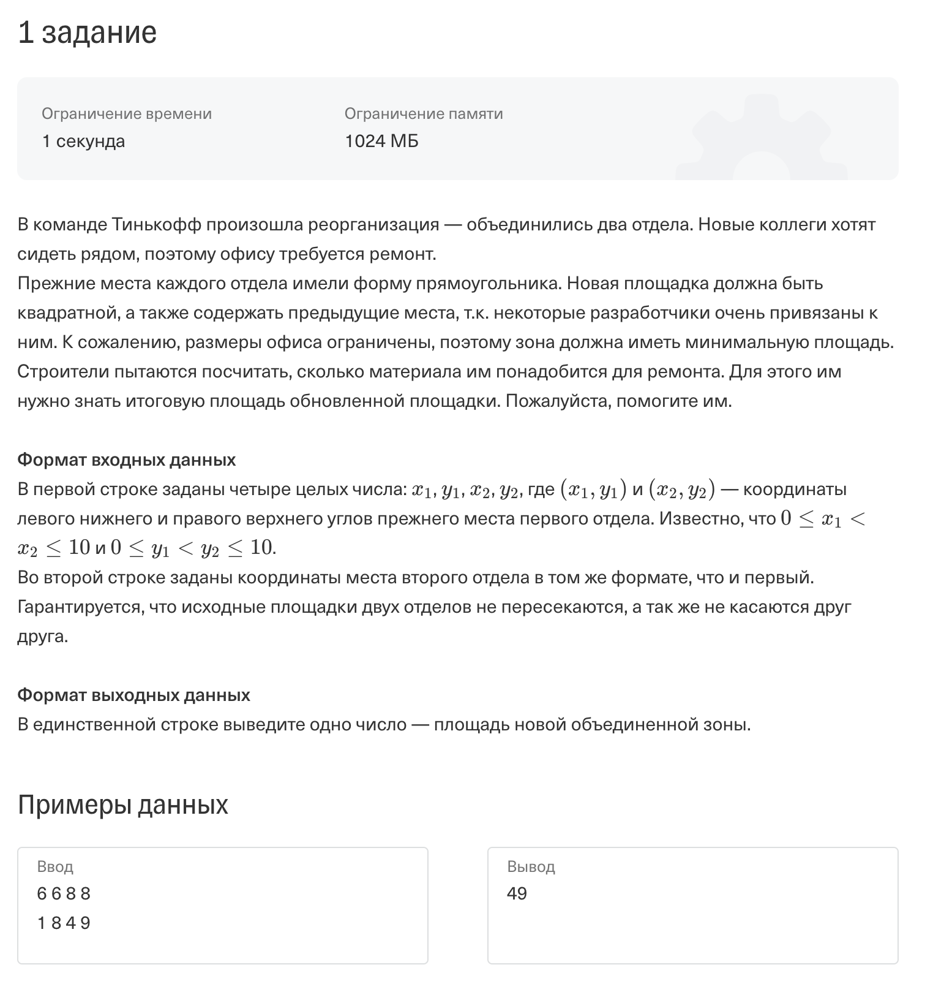
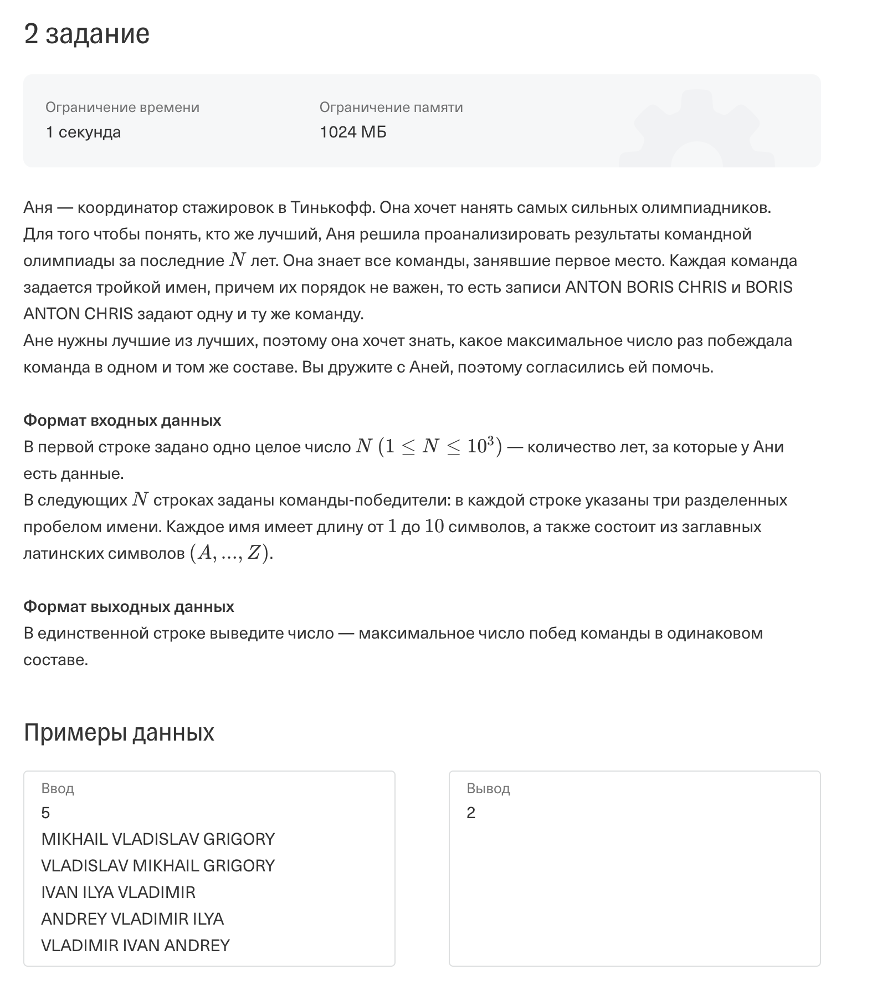
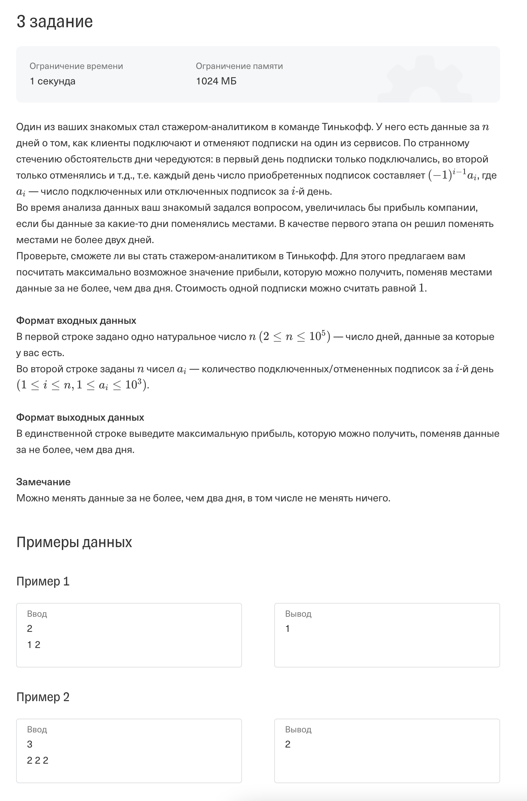
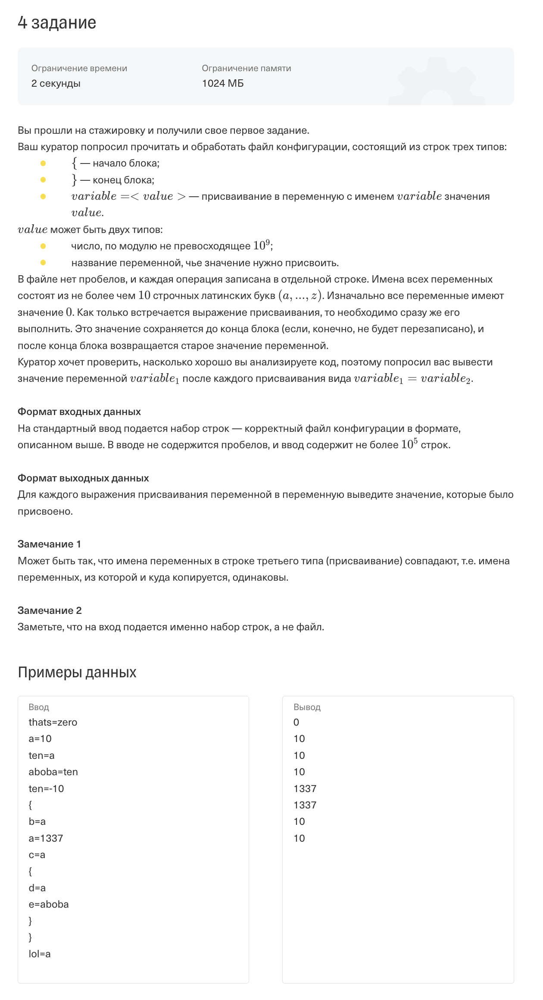
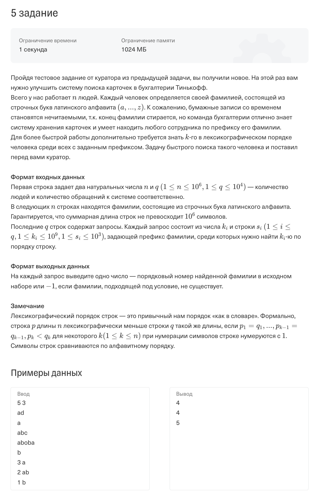
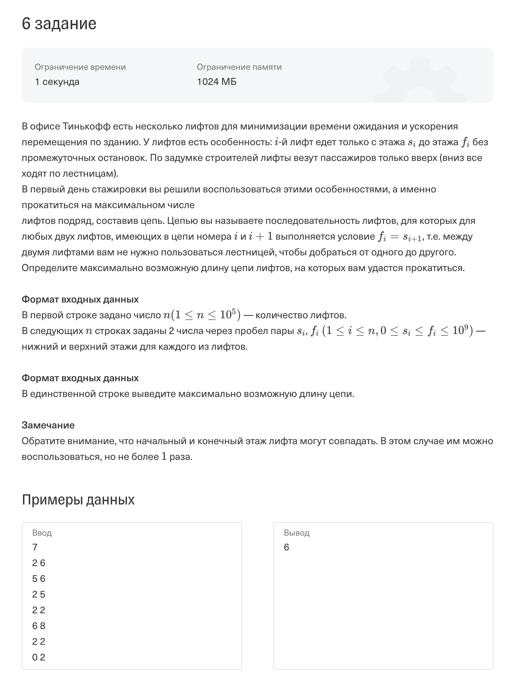
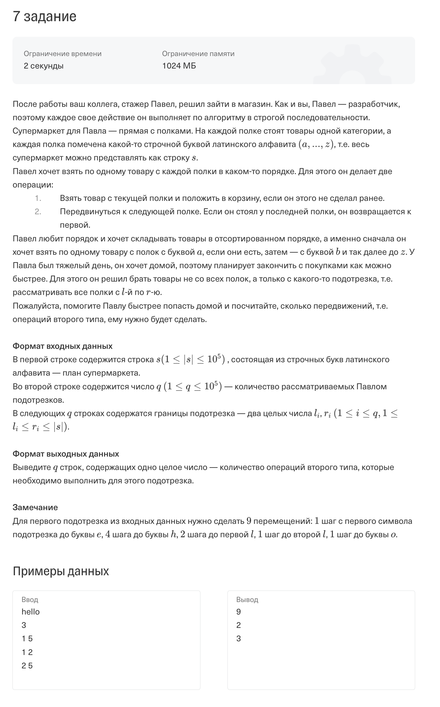
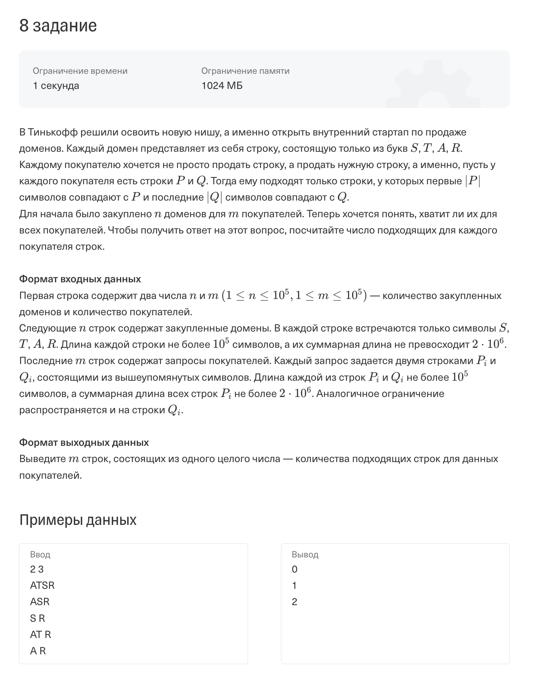

# Tinkoff_start

Решал тестовые задания на стажировку в Тинькофф

Экзамен длится 4.5 часа, 8 заданий, из них сделал 6.

Из интересного - поиск элемента в префиксном дереве (task 5) и поиск максимального пути в направленном графе (task 6).

Задания:

